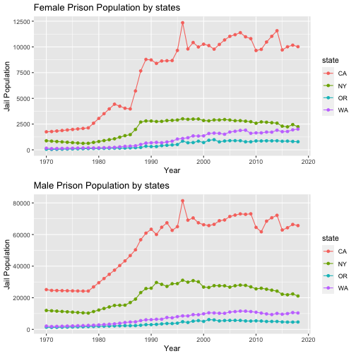

## Abstract 
In this assignment, I will use my data analysis and data visualization skills to discover the incarceration rates of the differences between two genders–male and female. Analyzing these two variables will allow me to understand gender discrimination differences and demonstrates the better view of gender inequality. 

## Introduction 
In the United States, the jail population is incessantly increasing as time goes by. With the increased jail population, the overcriminalization and mass incarceration of people of color, immigrants, and people experiencing poverty has increased. To discover this inequality in incarceration rates, I mainly focused on gender inequality and how the different region of the United States impacts the rates. 

## Data Summary 

The average jail population count of female was 5.4198 &times; 104.
The average jail population count of male was 4.28494 &times; 105.
The states with the highest number of jail population of female was AK, AL, AR, AZ, CA, CO, DC, FL, GA, HI, IA, ID, IL, IN, KS, KY, LA, MA, MD, ME, MI, MN, MO, MS, MT, NC, ND, NE, NH, NJ, NM, NV, NY, OH, OK, OR, PA, SC, SD, TN, TX, UT, VA, VT, WA, WI, WV, WY.
The states with the highest number of jail population of male was AK, AL, AR, AZ, CA, CO, DC, FL, GA, HI, IA, ID, IL, IN, KS, KY, LA, MA, MD, ME, MI, MN, MO, MS, MT, NC, ND, NE, NH, NJ, NM, NV, NY, OH, OK, OR, PA, SC, SD, TN, TX, UT, VA, VT, WA, WI, WV, WY.
The states with the lowest number of jail population of female was AK, AL, AR, AZ, CA, CO, DC, FL, GA, HI, IA, ID, IL, IN, KS, KY, LA, MA, MD, ME, MI, MN, MO, MS, MT, NC, ND, NE, NH, NJ, NM, NV, NY, OH, OK, OR, PA, SC, SD, TN, TX, UT, VA, VT, WA, WI, WV, WY.
The states with the lowest number of jail population of male was AK, AL, AR, AZ, CA, CO, DC, FL, GA, HI, IA, ID, IL, IN, KS, KY, LA, MA, MD, ME, MI, MN, MO, MS, MT, NC, ND, NE, NH, NJ, NM, NV, NY, OH, OK, OR, PA, SC, SD, TN, TX, UT, VA, VT, WA, WI, WV, WY.
The years with the highest number of jail population of female was 1970, 1971, 1972, 1973, 1974, 1975, 1976, 1977, 1978, 1979, 1980, 1981, 1982, 1983, 1984, 1985, 1986, 1987, 1988, 1989, 1990, 1991, 1992, 1993, 1994, 1995, 1996, 1997, 1998, 1999, 2000, 2001, 2002, 2003, 2004, 2005, 2006, 2007, 2008, 2009, 2010, 2011, 2012, 2013, 2014, 2015, 2016, 2017, 2018.
The years with the highest number of jail population of male was 1970, 1971, 1972, 1973, 1974, 1975, 1976, 1977, 1978, 1979, 1980, 1981, 1982, 1983, 1984, 1985, 1986, 1987, 1988, 1989, 1990, 1991, 1992, 1993, 1994, 1995, 1996, 1997, 1998, 1999, 2000, 2001, 2002, 2003, 2004, 2005, 2006, 2007, 2008, 2009, 2010, 2011, 2012, 2013, 2014, 2015, 2016, 2017, 2018.
The years with the lowest number of jail population of female was 1970, 1971, 1972, 1973, 1974, 1975, 1976, 1977, 1978, 1979, 1980, 1981, 1982, 1983, 1984, 1985, 1986, 1987, 1988, 1989, 1990, 1991, 1992, 1993, 1994, 1995, 1996, 1997, 1998, 1999, 2000, 2001, 2002, 2003, 2004, 2005, 2006, 2007, 2008, 2009, 2010, 2011, 2012, 2013, 2014, 2015, 2016, 2017, 2018.
The years with the lowest number of jail population of male was 1970, 1971, 1972, 1973, 1974, 1975, 1976, 1977, 1978, 1979, 1980, 1981, 1982, 1983, 1984, 1985, 1986, 1987, 1988, 1989, 1990, 1991, 1992, 1993, 1994, 1995, 1996, 1997, 1998, 1999, 2000, 2001, 2002, 2003, 2004, 2005, 2006, 2007, 2008, 2009, 2010, 2011, 2012, 2013, 2014, 2015, 2016, 2017, 2018.

## Growth of the U.S. Prison Population

Through this chart, I can determine the increase of jail population in the United States during 1970 to 2018. This bar chart shows how the incarceration rates changed over time, and I can notice that the jail population significantly increased in 1980 to 2008. 

## Growth of Prison Population by State

The line chart determines the growth of prison population by state, which I chose to analyze in California, New York, Oregon, and Washington. This chart shows the incarceration rates differences between the states, and I can determine that California has the highest rate while Oregon has the lowest rate. 

## The comparison of gender in growth of Prison Population by State

This chart compares two different and continuous variables that are related to one another. I have created line charts to illustrate the difference in male and female populations for imprisoned people over the years in 4 different states. From reflecting on this chart, the number of male prisoners is greater than female prisoners, as I expected.

## Map

By creating this geographical chart, I can determine which states had the highest and lowest number of males in jail in 2008. I chose these variables because I wanted to compare states in the year when they had the highest rates of the jail population in the US. For example, with this visualization, I can specify that California has the highest number of males in jail. From reflecting on this chart, I found it very interesting to compare and see the differences between the states and analyze the jail population using data visualization. 

